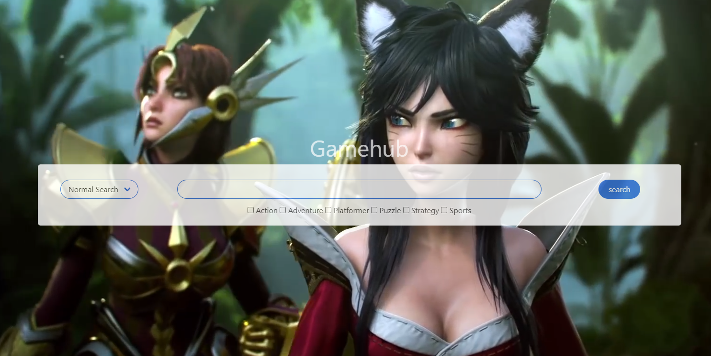

# Gamehub
This assignment was assigned by the U.C. Berkeley Extension Full-time Full Stack Flex Boot Camp.
This is the first major collaborative project assigned by the program. In this assignment our team was tasked to create a website that drew on multiple different APIs, used a CSS framework outside of the one we were taught in class, and used a Javascript library that we've never used before in class. The app runs in the browser and features dynamically updated HTML and CSS powered by JavaScript code. It has a clean, polished, and responsive user interface.

It contains notable features such as:
- A searchbar with a connected selector bar and check boxes all used to form the search query
- Input validation, an empty search bar after submitting will cause the placeholder text within to give the message: "PLEASE ENTER A SEARCH QUERY"
- A small loading bar that appears at the top of the page upon entering a query.
- A rendered list of games based on the form data given by the user on a new page after pressing the submit button
- Clickable list items for the rendered game list
- Renders game details, prices, and a provided youtube video about each list item upon clicking them

Due: Friday, April 9, 2021

## Built With
* [HTML](https://developer.mozilla.org/en-US/docs/Web/HTML)
* [CSS](https://developer.mozilla.org/en-US/docs/Web/CSS)
* [Javascript](https://developer.mozilla.org/en-US/docs/Web/JavaScript)

Using the following APIs:
* [rawg.io](https://api.rawg.io/docs/) A video game api
* [cheapshark API](https://apidocs.cheapshark.com/) An discount finder API for videogames
* [Youtube API](https://developers.google.com/youtube/v3) The API for all of youtube.com

Using the following Frameworks and Libraries:
- [Bulma](https://bulma.io/documentation/) CSS Framework
- [Axios](https://github.com/axios/axios) Promise based HTTP client for the browser and node.js
- [Moment.js](https://momentjs.com/docs/) Javascript library that formats time and dates
- [jQuery](https://api.jquery.com/) Javascript library for shortcut functions and easier manipulation of the DOM
- [Mprogress.js](https://github.com/lightningtgc/MProgress.js) Javascript library that renders a loading bar

## Deployed Link

* [See Live Site](https://acedyu.github.io/gamehub/)

## Authors
AcedYu
- [Link to Github](https://github.com/AcedYu)
- [Link to LinkedIn](https://www.linkedin.com/in/alex-yu-3712811b9/)

LiamStewart8
- [Link to Github](https://github.com/LiamStewart8)
- [Link to LinkedIn](https://www.linkedin.com/in/liamsctewart/)

TMPeeler
- [Link to Github](https://github.com/TMPeeler)
- [Link to LinkedIn](https://www.linkedin.com/in/thomas-peeler-2879bb208/)